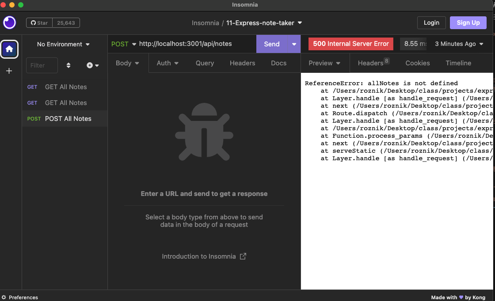
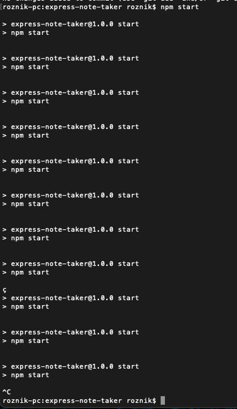
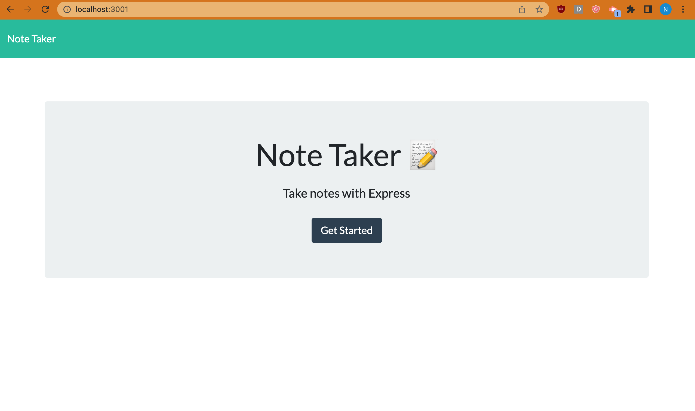
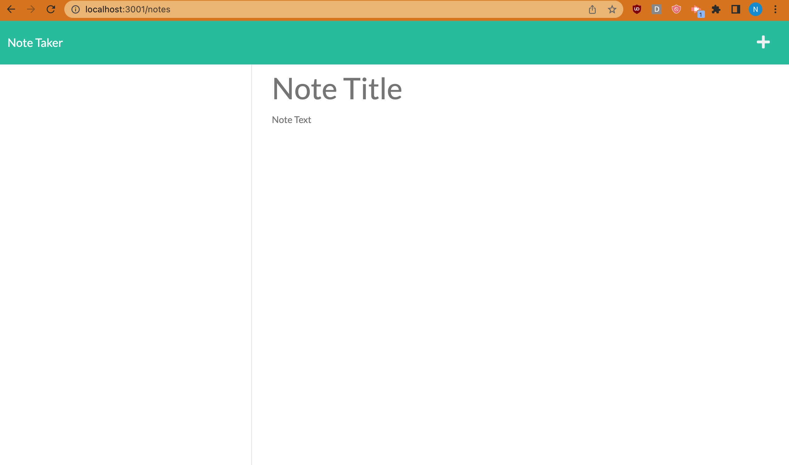

# Express Note Taker

## Description

```
Your challenge is to create an application called Note Taker that can be used to write and save notes. This application will use an Express.js back end and will save and retrieve note data from a JSON file.
```

I have been struggling a lot with this project. I will finish it in the next couple of weeks but the deadline is tonight so I am submitting what I have in the hope of getting partial credit.

[View my unsuccessful deployment here.](https://warm-badlands-92602.herokuapp.com/)

See some of the errors in this project below.





```
The application should have a db.json file on the back end that will be used to store and retrieve notes using the fs module.

The following HTML routes should be created:
- GET /notes should return the notes.html file.
- GET * should return the index.html file.

The following API routes should be created:
- GET /api/notes should read the db.json file and return all saved notes as JSON.
- POST /api/notes should receive a new note to save on the request body, add it to the db.json file, and then return the new note to the client. You'll need to find a way to give each note a unique id when it's saved (look into npm packages that could do this for you).
- DELETE /api/notes/:id should receive a query parameter containing the id of a note to delete. In order to delete a note, you'll need to read all notes from the db.json file, remove the note with the given id property, and then rewrite the notes to the db.json file.
```

## User Story
```
AS A small business owner
I WANT to be able to write and save notes
SO THAT I can organize my thoughts and keep track of tasks I need to complete
```

## Acceptance Criteria
```
GIVEN a note-taking application
WHEN I open the Note Taker
THEN I am presented with a landing page with a link to a notes page
WHEN I click on the link to the notes page
THEN I am presented with a page with existing notes listed in the left-hand column, plus empty fields to enter a new note title and the note’s text in the right-hand column
WHEN I enter a new note title and the note’s text
THEN a Save icon appears in the navigation at the top of the page
WHEN I click on the Save icon
THEN the new note I have entered is saved and appears in the left-hand column with the other existing notes
WHEN I click on an existing note in the list in the left-hand column
THEN that note appears in the right-hand column
WHEN I click on the Write icon in the navigation at the top of the page
THEN I am presented with empty fields to enter a new note title and the note’s text in the right-hand column
```

## Mock Up



## Installation and Usage
```
Once you clone the project, enter npm i in the command line.
Use npm start to initialize the application.
```

## Project Requirements
```
Technical Acceptance Criteria: 40%
Satisfies all of the preceding acceptance criteria plus the following:
Yes - Application front end must connect to an Express.js back end.
No - Application back end must store notes with unique IDs in a JSON file.
No - Application must be deployed to Heroku.

Deployment: 36%
No - Application deployed at live URL.
No - Application loads with no errors.
Yes - Application GitHub URL submitted.
Yes - GitHub repository contains application code.

Application Quality: 11%
No - Application console is free of errors.

Repository Quality: 13%
Yes - Repository has a unique name.
Yes - Repository follows best practices for file structure and naming conventions.
Yes - Repository follows best practices for class/id naming conventions, indentation, quality comments, etc.
Yes - Repository contains multiple descriptive commit messages.
Yes - Repository contains quality README file with description, screenshot, and link to deployed application.

Bonus
Fulfilling the following can add 10 points to your grade. Note that the highest grade you can achieve is still 100:
Not functional - Application allows users to delete notes.
```

## Contributors & Questions

A big thank you to my TAs, AskBCS, my tutor, and my classmates for trying to help me figure this out!